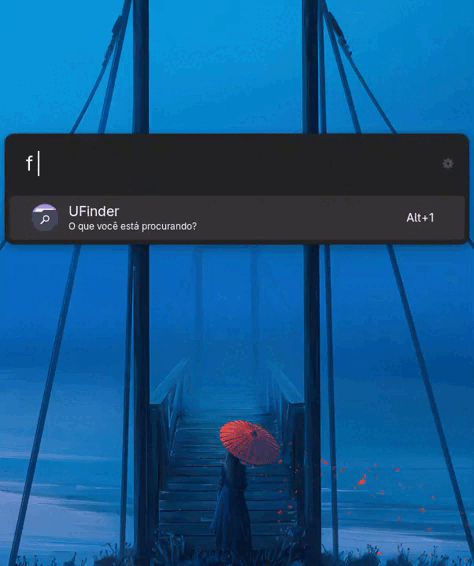

# 🔍 UFinder for Ulauncher

**UFinder** is an ultra-fast file search extension for Ulauncher. It indexes your Home folder in the background, allowing you to find documents, images, folders, and system files instantly — without freezing the interface.



---

## ✨ Features

- ⚡ **Real-time search**: Intelligent indexing that doesn't consume your CPU
- 📂 **System Folders Recognition**: Custom icons and descriptions for Desktop, Downloads, Documents, etc.
- 🌍 **Internationalization (i18n)**: Automatic support for English, Portuguese, Spanish, German, French, and Russian
- 🖼️ **Icon Previews**: Specific icons for PDFs, Images, Music, Videos, and Spreadsheets
- ⚙️ **Customizable Actions**: Choose between opening the file directly or revealing its folder in your file manager

---

## 🚀 Installation

1. Open Ulauncher Preferences
2. Go to **Extensions → Add extension**
3. Paste the repository URL:
   ```
   https://github.com/elx4vier/ufinder
   ```

---

## 🛠️ Configuration

After installing, you can customize the extension in the preferences:

| Option           | Description                                              | Default |
|------------------|----------------------------------------------------------|---------|
| Keyword          | Trigger keyword to activate the search                   | `f`     |
| Results limit    | Maximum number of results shown                          | 9       |
| Default action   | `Open` (opens the file) or `Reveal` (opens the folder)   | Open    |
---

- Icons from the Papirus Icon Theme
👨‍💻 Developed by **Xavier**
